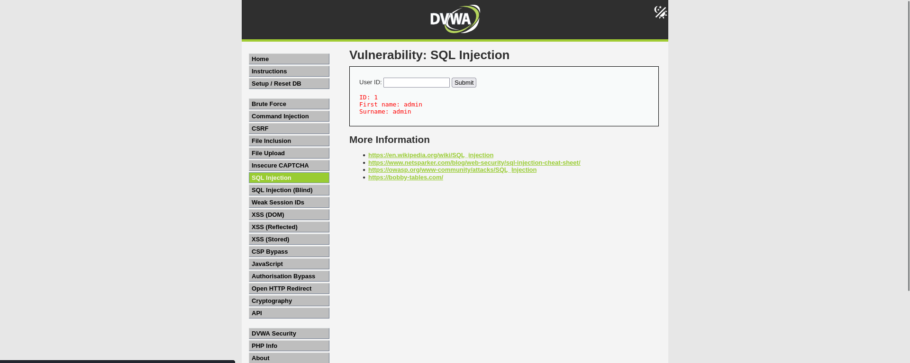
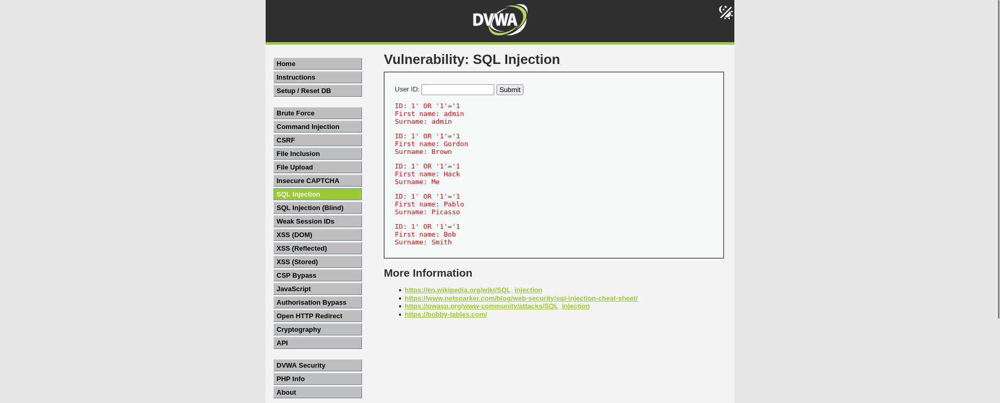

# SQL Injection Testing – DVWA

# Overview

This lab demonstrates basic SQL Injection testing using Damn Vulnerable Web Application (DVWA) in a controlled lab environment.
The testing focused on identifying vulnerable input handling in the User ID parameter and analyzing how improper validation can expose sensitive database information.

# Objective
* Identify SQL Injection vulnerability
* Test malicious SQL payloads
* Observe database response behavior
* Understand security impact

# Environment
* Kali Linux
* DVWA (Damn Vulnerable Web Application)
* Firefox Browser

# Payload Used

```sql
' OR '1'='1
```

# Testing Process

1. Opened DVWA SQL Injection module
2. Tested normal input values
3. Injected SQL payload into User ID parameter
4. Observed multiple database records returned by application
5. Confirmed vulnerable SQL query handling

# Observation

The application returned multiple user records, including administrative user information, after injecting the SQL payload.
This confirmed that user input was not properly sanitized before being processed in backend SQL queries.

# Security Impact
An attacker could exploit this vulnerability to:
* Access unauthorized database records
* Bypass authentication mechanisms
* Extract sensitive information
* Manipulate backend database queries
  
# Mitigation
* Use parameterized queries (Prepared Statements)
* Validate and sanitize user input
* Implement server-side filtering
* Avoid dynamic SQL query construction
  

# Result
SQL Injection vulnerability successfully identified and validated in DVWA lab environment.

## Screenshots

### Normal Application Behavior



### SQL Injection Payload Exploitation



