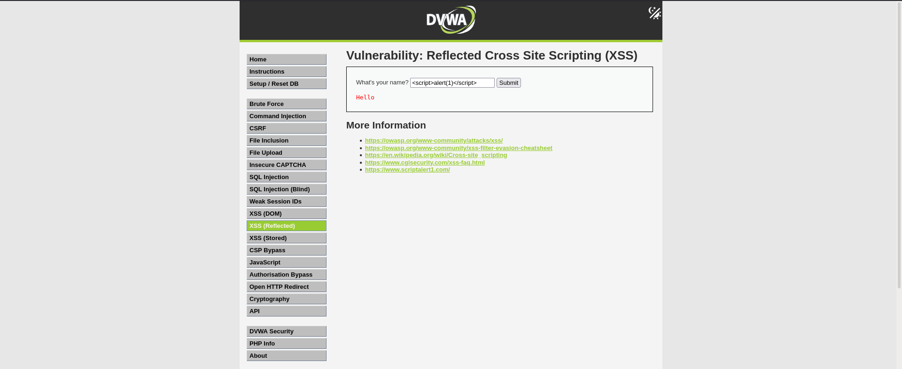
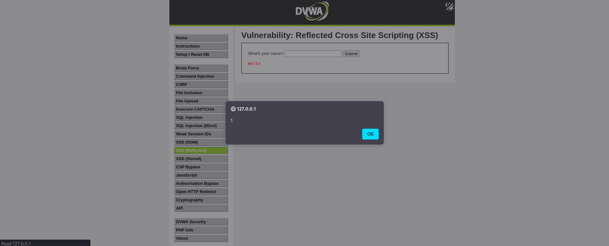

# Reflected Cross-Site Scripting (XSS) – DVWA

# Overview
This lab demonstrates reflected Cross-Site Scripting (XSS) testing using Damn Vulnerable Web Application (DVWA) in a controlled lab environment.
The testing focused on identifying improper input sanitization in user-controlled input fields.

# Objective
* Identify reflected XSS vulnerability
* Execute JavaScript payload
* Analyze client-side script execution
* Understand security impact of unsanitized input

# Environment
* Kali Linux
* DVWA (Damn Vulnerable Web Application)
* Firefox Browser

# Payload Used

```html id="q4x8vn"
<script>alert(1)</script>
```

# Testing Process
1. Opened DVWA Reflected XSS module
2. Entered JavaScript payload into input field
3. Submitted payload through web application
4. Observed JavaScript execution in browser
5. Confirmed reflected XSS vulnerability

# Observation
The application reflected user input without proper sanitization and executed JavaScript code in the browser.
A popup alert was triggered successfully, confirming the presence of a reflected XSS vulnerability.

# Security Impact

An attacker could exploit this vulnerability to:
* Execute malicious JavaScript in victim browsers
* Steal session cookies
* Perform phishing attacks
* Manipulate webpage content
* Redirect users to malicious websites

# Mitigation
* Validate and sanitize user input
* Encode output properly
* Implement Content Security Policy (CSP)
* Restrict unsafe JavaScript execution

# Result

Reflected Cross-Site Scripting (XSS) vulnerability successfully identified and validated in DVWA lab environment.

## Screenshots

### XSS Payload Input



### Successful JavaScript Execution



