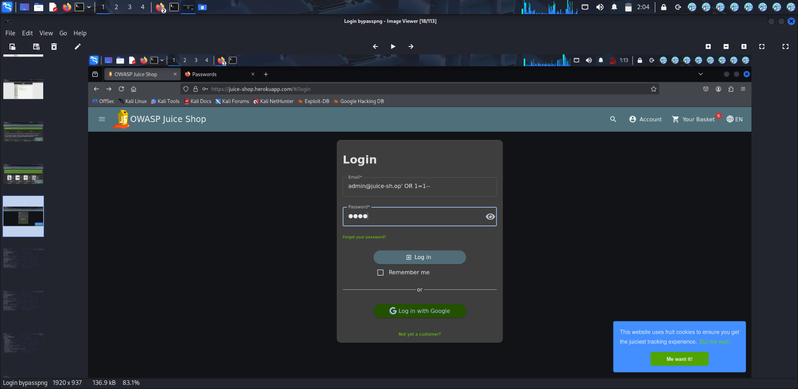
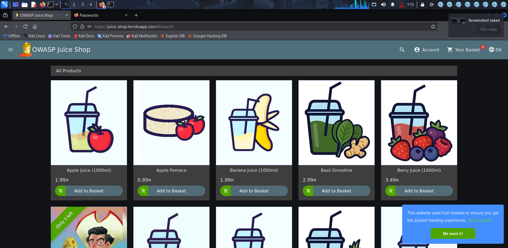

# SQL Injection Testing – OWASP Juice Shop

## Objective

The objective of this lab was to perform basic SQL Injection testing on the OWASP Juice Shop login functionality and observe authentication behavior caused by improper input handling.

## Target Application

* OWASP Juice Shop
* Testing Environment: Kali Linux
* Vulnerability Category: SQL Injection (Authentication Bypass)

## Methodology

1. Opened the OWASP Juice Shop login page.
2. Identified the email and password input fields for testing.
3. Entered a crafted SQL Injection payload into the login form.
4. Submitted the payload to observe application behavior.
5. Analyzed the authentication response and redirection behavior after login.

## Payload Used

```sql
admin@juice-sh.op' OR 1=1--
```
## Testing Results

* The application accepted the crafted payload during authentication testing.
* After login submission, the application redirected to the product dashboard.
* This behavior demonstrated improper input validation and insecure handling of authentication queries.

## Security Impact

If improperly secured in real-world applications, SQL Injection vulnerabilities may allow:

* Unauthorized access to application accounts
* Authentication bypass
* Database manipulation
* Exposure of sensitive information
  
## Mitigation Recommendations

* Use parameterized queries / prepared statements
* Implement server-side input validation
* Apply proper authentication controls
* Sanitize user-supplied input
* Use Web Application Firewalls (WAF)

## Screenshots

### Login Payload Testing



### Dashboard Access After Login



## Conclusion

This lab demonstrated basic SQL Injection testing techniques using OWASP Juice Shop in a controlled environment. The exercise improved understanding of authentication bypass behavior and secure input handling practices.

