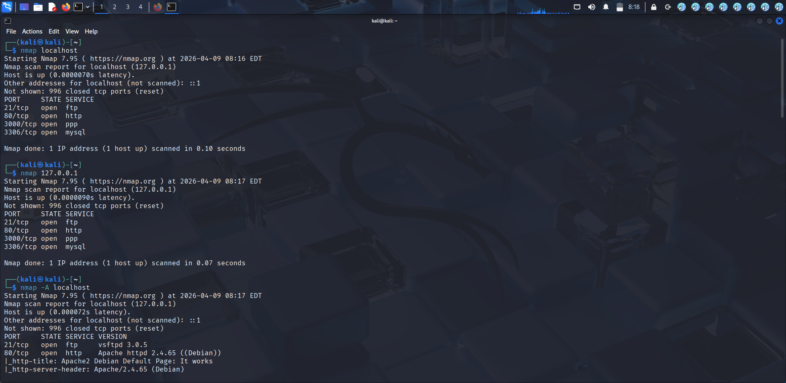
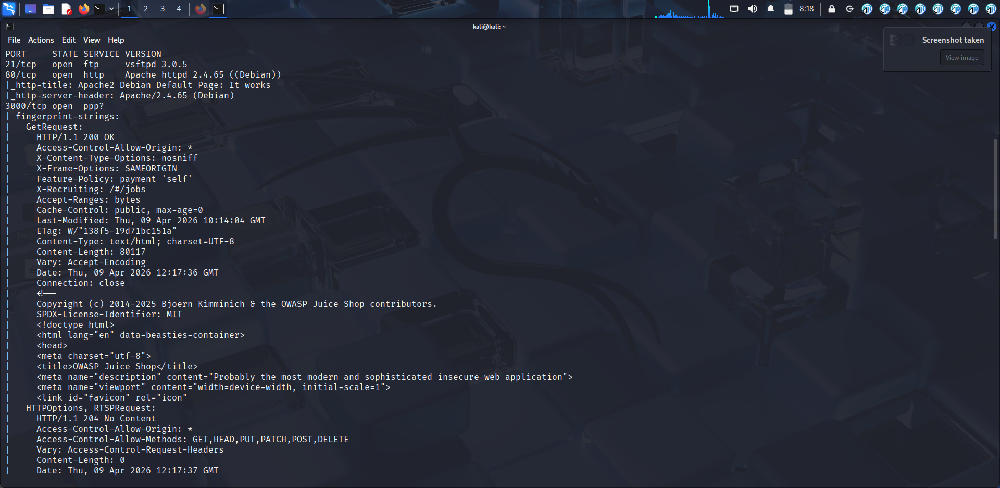
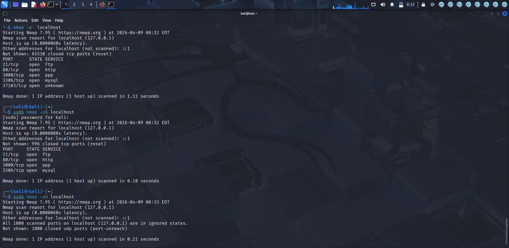
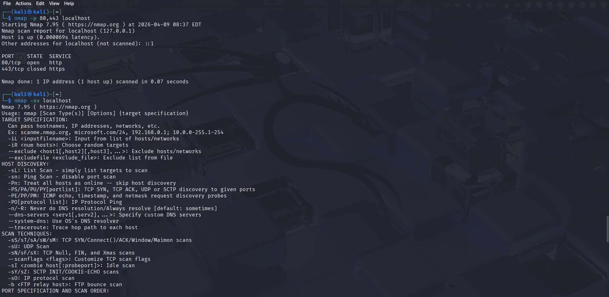

# Nmap Scan - Localhost

Overview:
This project shows how I used Nmap to scan my system (localhost) and find open ports, services, and security risks.

Target:
127.0.0.1 (localhost)

Commands Used:
nmap localhost
nmap 127.0.0.1
nmap -A localhost
nmap -p 80,443 localhost
sudo nmap -sS localhost
sudo nmap -sU localhost

Findings:
Open Ports:
- 21 → FTP
- 80 → HTTP
- 3000 → Web App
- 3306 → MySQL

Service Info:
- FTP → vsftpd 3.0.5
- HTTP → Apache 2.4.65
- MySQL → Running

Port Scan:
- Port 80 → Open
- Port 443 → Closed

UDP Scan:
- No open UDP ports

Impact:
- Multiple services are running
- Web app is accessible
- Database is exposed
- Can increase attack risk

Mitigation:
- Close unused ports
- Use firewall
- Secure database
- Do regular scans

Screenshots:
Basic Scan:

Service Scan:

Advanced Scan:

Port Scan:

Conclusion:
Nmap helped identify open ports and services. This shows how attackers can find entry points and why security is important.
