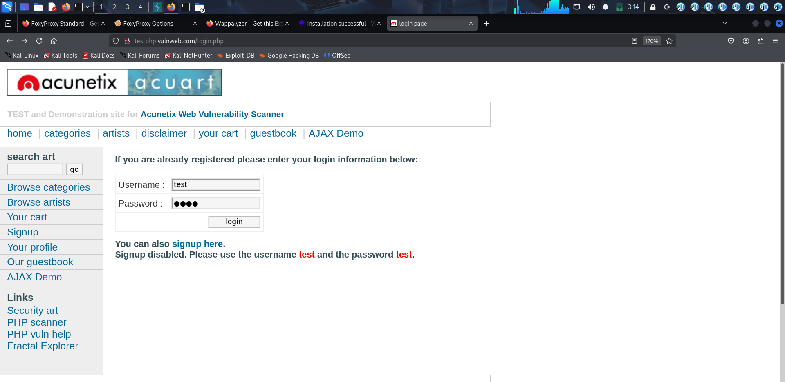
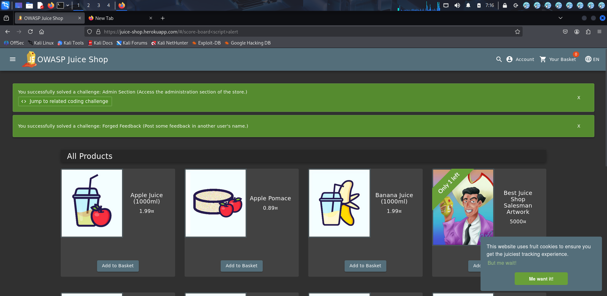

# SQL Injection - OWASP Juice Shop

## Overview
SQL Injection allows bypassing authentication by manipulating database queries.

## Target
OWASP Juice Shop Login Page

## Payload Used
' OR 1=1 --

## Steps to Reproduce
1. Open login page
2. Enter payload in email field
3. Enter any password
4. Login successful without valid credentials

## Impact
- Unauthorized access
- Admin account compromise
- Data exposure risk

## Mitigation
- Use parameterized queries
- Input validation
- Prepared statements

## Proof
### 🔹 Payload Injection (Login Bypass)

### 🔹 Admin Access Achieved

