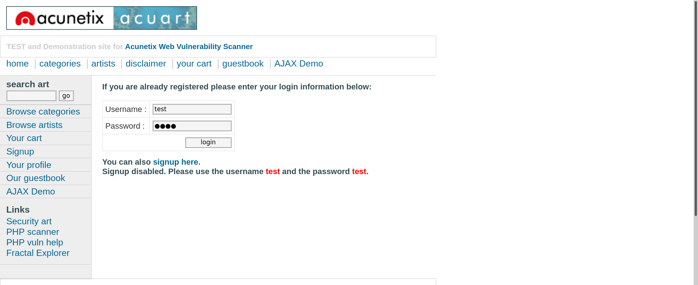
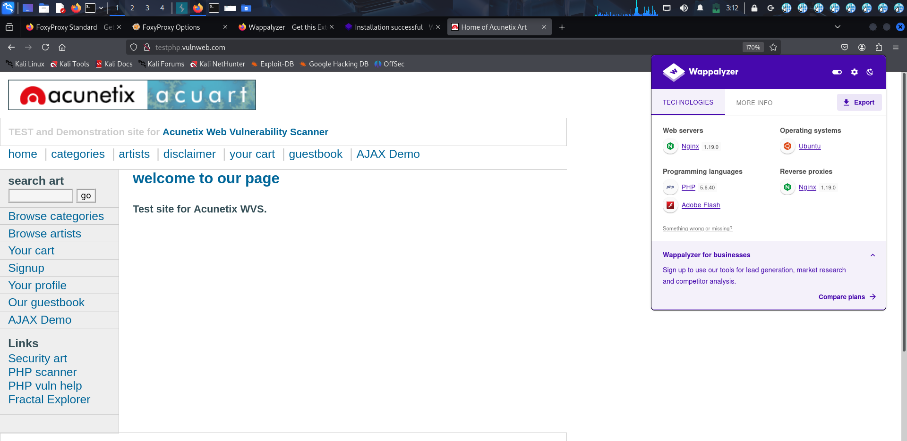
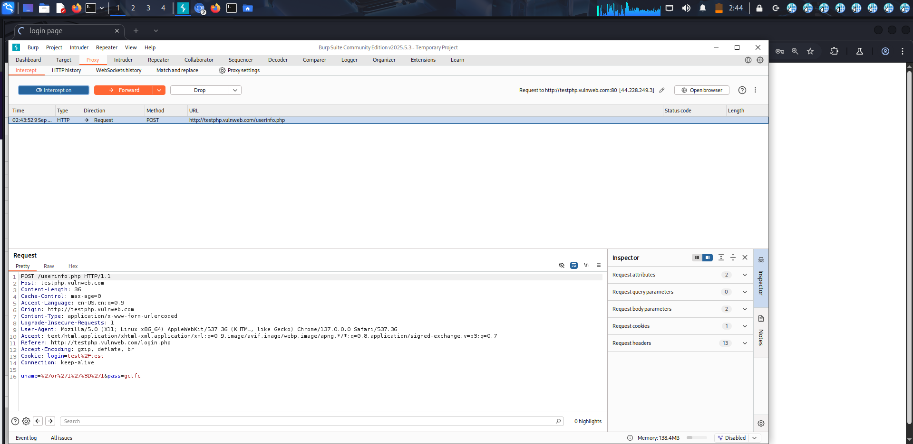
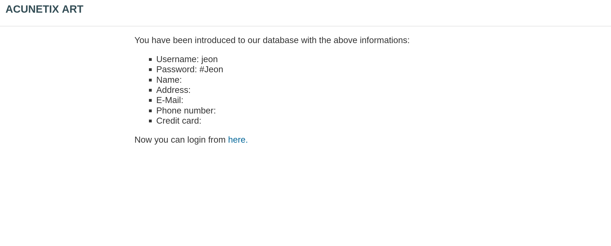

# Authentication Testing – Acunetix TestPHP Application

## Objective
The objective of this lab was to perform basic authentication security testing on the Acunetix TestPHP web application and analyze login request behavior using Burp Suite.

## Target Application
* Acunetix TestPHP
* URL: http://testphp.vulnweb.com
* Testing Environment: Kali Linux
* Testing Type: Authentication Testing & Request Analysis

## Methodology
1. Opened the TestPHP login page in the browser.
2. Entered test credentials into the login form.
3. Intercepted the authentication request using Burp Suite.
4. Analyzed POST request parameters and login behavior.
5. Observed application responses after authentication.

## Testing Activities
* Login form analysis
* HTTP request interception
* POST parameter inspection
* Authentication workflow observation
* Request and response analysis using Burp Suite

## Security Observations
* Authentication requests were visible through Burp Suite interception.
* User input fields transmitted authentication parameters through POST requests.
* Improper validation or weak authentication logic may increase security risks in vulnerable applications.

## Potential Security Risks
* Authentication bypass possibilities
* Credential exposure risks
* Session manipulation
* Weak input validation

## Technology Reconnaissance
As part of the assessment, basic technology fingerprinting was performed using the Wappalyzer browser extension to identify technologies used by the target application.

### Technologies Identified
* Nginx Web Server
* PHP
* Ubuntu Operating System

### Security Relevance

Technology reconnaissance helps security testers understand:

* Web application architecture
* Potential attack surface
* Server technologies in use
* Areas that may require further security assessment

## Mitigation Recommendations
* Implement secure authentication mechanisms
* Use strong server-side validation
* Enable secure session handling
* Apply rate limiting and account protection controls
* Encrypt sensitive communication using HTTPS

## Screenshots

### Login Page

### Technology Reconnaissance (Wappalyzer)

### Burp Suite Request Interception

###  User Registration / Data Handling

## Conclusion
This lab improved understanding of web authentication testing, request interception, and login workflow analysis using Burp Suite in a controlled testing environment.
